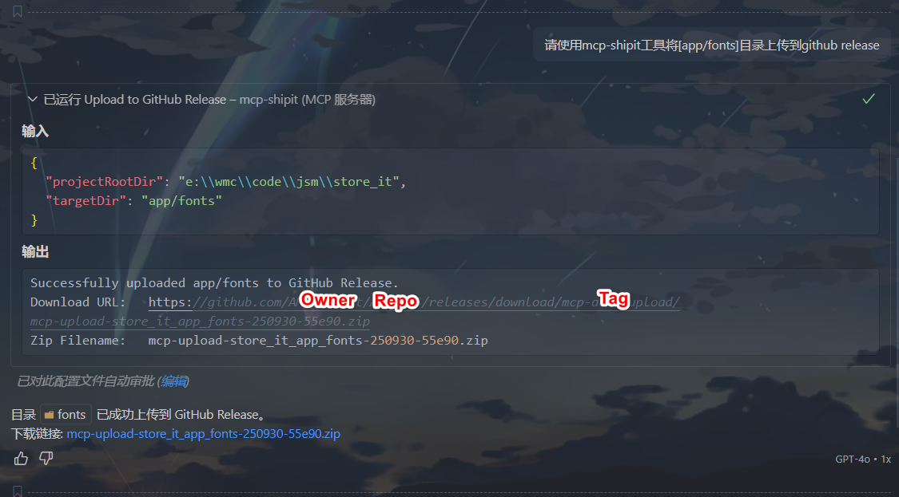

# mcp-shipit

[](https://npmjs.org/package/@amingdrift/mcp-shipit)
[](https://npmjs.org/package/@amingdrift/mcp-shipit)

English | [中文](README_zh-CN.md)

mcp-shipit is a [Model Context Protocol](https://modelcontextprotocol.io/introduction) (MCP)-based tool that can package specified directories into a ZIP file and upload them to GitHub Release.

## Why This Tool?

This tool was created to solve a common problem in development workflows: sharing test resources (such as mock images, videos, and other large binary files) between multiple development machines.

Often, developers need to share these test resources but don't want to commit them to the git repository, as they can bloat the repository size. Traditional solutions like uploading to cloud drives require manual repetitive operations - download, extract, move to the right place, etc.

With mcp-shipit, you can simply tell your AI programming assistant (like VS Code Copilot, Tongyi Lingma) to "upload the mock resources directory to GitHub Release" or "download the test assets from GitHub Release", and the tool automatically handles the entire process. This makes it seamless to share test resources between multiple development environments.

## Key Features

- 📦 Package project directories into ZIP files
- ☁️ Automatically upload to GitHub Release
- 🏷️ Support creating or reusing Release tags
- 🔌 Integration via MCP protocol
- ⬇️ Support downloading and extracting from GitHub Release
- 🌐 Proxy support for GitHub API access

## Integration

mcp-shipit is an MCP tool that cannot be called directly from the command line. It needs to be integrated into AI programming tools that support the MCP protocol, such as VS Code Copilot, Tongyi Lingma, Trae, etc.

## Quick Start

### 1. Prerequisites

- Node.js v20+
- GitHub Personal Access Token ([Guide](https://github.com/settings/tokens/new))

### 2. GitHub API Permission Instructions

The mcp-shipit tool needs to use the GitHub API to upload and download Release files. For this purpose, you need to create a Personal Access Token (PAT) and grant appropriate permissions.

When creating a new token at [https://github.com/settings/tokens/new](https://github.com/settings/tokens/new), select the following permissions based on your use case:

#### Upload Release Files

Requires `repo` permission (full control of private and public repositories), which includes:

- `public_repo` (access public repositories)
- Allows creating releases and uploading release assets

#### Download Release Files

- Public repositories: `public_repo` permission
- Private repositories: `repo` permission

#### Recommended Configuration

| Use Case               | Recommended Permissions |
| ---------------------- | ----------------------- |
| Upload/manage Releases | ✅ `repo`               |
| Download Release files | ✅ `repo`               |

> 📌 To ensure proper functionality, it is recommended to directly select the `repo` permission, which supports both upload and download operations

### 3. Installation

```bash
npm install -g @amingdrift/mcp-shipit
```

### 4. Integration Configuration

Configure the service in MCP-supported tools, configuration guides:

- [VS Code Copilot](https://vscode.js.cn/docs/copilot/customization/mcp-servers#_add-an-mcp-server)
- [Tongyi Lingma](https://help.aliyun.com/zh/lingma/user-guide/guide-for-using-mcp#d60f59f38ap5c)
- [Trae](https://docs.trae.ai/ide/model-context-protocol?_lang=zh#0b1e1b2c)

VS Code Copilot configuration example:

```json
{
    "servers": {
        "mcp-shipit": {
            "type": "stdio",
            "command": "npx",
            "args": ["@amingdrift/mcp-shipit"],
            "env": {
                "SHIPIT_GITHUB_TOKEN": "your-token",
                "SHIPIT_GITHUB_OWNER": "your-owner",
                "SHIPIT_GITHUB_REPO": "your-repo"
            }
        }
    }
}
```

**Environment Variables:**

- `SHIPIT_GITHUB_TOKEN` (Required): GitHub access token
- `SHIPIT_GITHUB_OWNER` (Required): Repository owner
- `SHIPIT_GITHUB_REPO` (Required): Repository name
- `SHIPIT_GITHUB_TAG` (Optional): Release tag name, default `mcp-auto-upload`
- `SHIPIT_PROXY` (Optional): Proxy address

> Environment variables can be set in the `.env` file in the project root directory, which takes precedence over configuration files.

### 5. Usage (using VS Code Copilot with Agent mode as an example)

**Upload Directory:**

```
Please use the mcp-shipit tool to package [relative directory path] and upload it to GitHub Release
```



**Download File:**

```
Please use the mcp-shipit tool to download [filename.zip] from GitHub release to [target directory] [merge|overwrite]
```


## Notes

- Ensure GitHub Token has repository write permissions
- The upload directory must exist and be accessible
- When downloading, files with the same name will be overwritten, and the original directory will be backed up as `_bak`
- Proxy can be configured when network is slow
- Only tested with VS Code Copilot, Tongyi Lingma, and Trae AI programming tools. Other tools like Claude Desktop and Cursor can be tried by users
- Must be used via Agent/Builder with MCP to create automated workflows

## License

[ISC](LICENSE)
