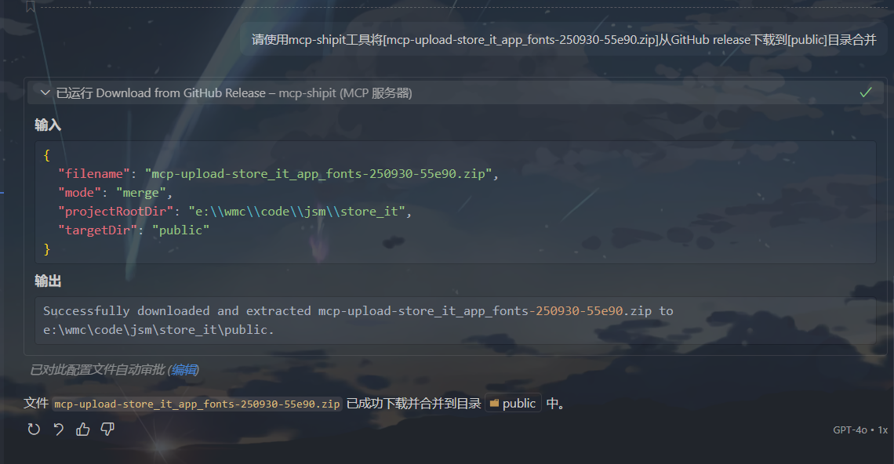

# mcp-shipit

mcp-shipit 是一个基于 [模型上下文协议 (MCP)](https://modelcontextprotocol.io/introduction) 的工具，可以将指定的目录打包成 ZIP 文件并上传到 GitHub Release。

## 功能特点

- 📦 将项目中任意目录打包成 ZIP 文件
- ☁️ 自动上传到 GitHub Release
- 🏷️ 支持创建或复用现有的 Release 标签
- 🔌 通过 MCP 协议提供服务，可与其他 MCP 客户端集成
- ⬇️ 支持从 GitHub Release 下载文件并解压到指定目录
- 🌐 支持通过代理访问 GitHub API

## 前提条件

1. Node.js (v20.x 或更高版本)
2. Github API 访问权限

## 认证

使用 mcp-shipit 需要 Github API 认证：

### 获取 GitHub Personal Access Token

1. 访问 GitHub 的 [New personal access token 页面](https://github.com/settings/tokens/new)
2. 选择适当的权限范围（public仓库需要`public_repo`权限，private仓库至少需要 `repo` 权限）
3. 生成并保存 token

## 安装

### VSCode编辑器集成(Copilot)

按照官方文档 [添加 MCP 服务器](https://vscode.js.cn/docs/copilot/customization/mcp-servers#_add-an-mcp-server)，我自己使用 `将 MCP 服务器添加到您的用户配置`

`mcp.json`

```json
{
    "servers": {
        "mcp-shipit": {
            "type": "stdio",
            "command": "npx",
            "args": ["@amingdrift/mcp-shipit"],
            "env": {
                "SHIPIT_GITHUB_TOKEN": "<您的 GitHub Personal Access Token>",
                "SHIPIT_GITHUB_OWNER": "<您的 GitHub Owner>",
                "SHIPIT_GITHUB_REPO": "<您的 GitHub Repo>",
                "SHIPIT_PROXY": "<代理地址>"
            }
        }
    }
}
```

### 通义灵码

按照官方文档 [MCP 服务配置与使用](https://help.aliyun.com/zh/lingma/user-guide/guide-for-using-mcp#d60f59f38ap5c)，手动添加，也可以配置文件添加

`lingma_mcp.json`

```json
{
    "mcpServers": {
        "mcp-shipit": {
            "command": "npx",
            "args": ["@amingdrift/mcp-shipit"],
            "env": {
                "SHIPIT_GITHUB_TOKEN": "<您的 GitHub Personal Access Token>",
                "SHIPIT_GITHUB_OWNER": "<您的 GitHub Owner>",
                "SHIPIT_GITHUB_REPO": "<您的 GitHub Repo>",
                "SHIPIT_PROXY": "<代理地址>"
            }
        }
    }
}
```

### Trae

[Trae官网手动添加MCP配置](https://docs.trae.ai/ide/model-context-protocol?_lang=zh#0b1e1b2c)

```json
{
    "mcpServers": {
        "mcp-shipit": {
            "command": "npx",
            "args": ["@amingdrift/mcp-shipit"],
            "env": {
                "SHIPIT_GITHUB_TOKEN": "<您的 GitHub Personal Access Token>",
                "SHIPIT_GITHUB_OWNER": "<您的 GitHub Owner>",
                "SHIPIT_GITHUB_REPO": "<您的 GitHub Repo>",
                "SHIPIT_PROXY": "<代理地址>"
            }
        }
    }
}
```

> [!TIP]
>
> 1. 添加 MCP 服务后三者在聊天窗口都需要使用`[Agent/智能体/@Builder with MCP]`才能调用MCP功能。
> 2. MCP 服务支持以下环境变量：
>
> - 添加的 MCP 服务支持以下必填的环境变量(缺一就会中断执行)：
>     - `SHIPIT_GITHUB_TOKEN`: 您的 GitHub Personal Access Token
>     - `SHIPIT_GITHUB_OWNER`: 您的 GitHub Owner
>     - `SHIPIT_GITHUB_REPO`: 您的 GitHub Repo
> - 添加的 MCP 服务支持以下可选的环境变量：
>     - `SHIPIT_GITHUB_TAG`：上传的压缩包放入哪个TAG的release下，默认为 mcp-auto-upload
>     - `SHIPIT_PROXY`：代理地址，如我自己的wsl2环境中配置为 <http://172.19.80.1:7897>
>
> 3. 还可以在项目根目录的`.env`中添加环境变量，可覆盖mcp配置文件中环境变量

## 使用

### 调用上传功能提示词

请使用 mcp-shipit 工具将项目中的 [相对目录路径] 目录打包上传到 GitHub Release。


### 调用下载功能提示词

请使用 mcp-shipit 工具将 [Github release对应TAG中的压缩包名称.zip] 从GitHub release下载到[public/assets]目录 [合并|覆盖]


### 关键要素

在编写提示词时，应包含以下关键信息：

1. 明确提及要使用的工具（shipit 或 mcp_shipit）
2. 指定要上传的目录路径（相对于项目根目录）
3. 可以说明期望的结果（下载到指定目录后是覆盖还是合并，默认覆盖）

这样编写的提示词能够清楚地传达您的意图，使工具能够正确执行上传操作。

## 工作原理

对于上传功能：

1. 接收客户端请求，包含要上传的目录信息
2. 将指定目录压缩成 ZIP 文件
3. 查找或创建名为 "mcp-auto-upload" 的 GitHub Release
4. 将 ZIP 文件上传到该 Release
5. 返回文件的下载链接

对于下载功能：

1. 接收客户端请求，包含要下载的文件信息
2. 从指定的 GitHub Release 下载 ZIP 文件到临时目录
3. 根据模式参数准备目标目录（备份现有目录）
4. 将 ZIP 文件解压到目标目录
5. 返回解压完成的信息

## 注意事项

- 确保提供的 GitHub Token 具有对目标仓库的写入权限
- 上传的目标目录必须存在且可访问
- 上传的文件默认会存储在名为 "mcp-auto-upload" 的 Release 中
- 下载时确保文件名正确
- 下载时，如有现有目标目录会被备份（添加 `_bak` 后缀）
- 在合并模式下，目标目录中的独有文件会被保留，同名文件会被覆盖
- 如果遇到网络访问缓慢问题，可以配置代理加速 GitHub API 访问
