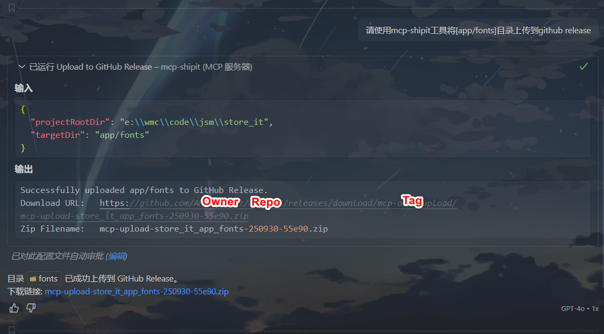

# mcp-shipit

[](https://npmjs.org/package/@amingdrift/mcp-shipit)
[](https://npmjs.org/package/@amingdrift/mcp-shipit)

[English](README.md) | 中文

mcp-shipit 是一个基于 [模型上下文协议 (MCP)](https://modelcontextprotocol.io/introduction) 的工具，可以将指定的目录打包成 ZIP 文件并上传到 GitHub Release。

## 主要功能

- 📦 打包项目目录为 ZIP 文件
- ☁️ 自动上传到 GitHub Release
- 🏷️ 支持创建或复用 Release 标签
- 🔌 通过 MCP 协议集成
- ⬇️ 支持从 GitHub Release 下载并解压
- 🌐 支持代理访问 GitHub API

## 集成方式

mcp-shipit 是一个 MCP 工具，不能直接通过命令行调用，需要集成到支持 MCP 协议的 AI 编程工具中使用，如 VS Code Copilot、通义灵码、Trae 等。

## 快速开始

### 1. 前提条件

- Node.js v20+
- GitHub Personal Access Token ([获取指引](https://github.com/settings/tokens/new))

### 2. GitHub API 权限说明

mcp-shipit 工具需要通过 GitHub API 上传和下载 Release 文件，为此你需要创建一个 Personal Access Token (PAT) 并授予适当权限。

在 [https://github.com/settings/tokens/new](https://github.com/settings/tokens/new) 创建新 token 时，根据你的使用场景选择以下权限：

#### 上传 Release 文件

需要 `repo` 权限（完整控制私有和公有仓库），该权限包含：

- `public_repo`（访问公有仓库）
- 允许创建 release 和上传 release assets

#### 下载 Release 文件

- 公有仓库：`public_repo` 权限
- 私有仓库：`repo` 权限

#### 推荐配置

| 使用场景          | 建议权限  |
| ----------------- | --------- |
| 上传/管理 Release | ✅ `repo` |
| 下载 Release 文件 | ✅ `repo` |

> 📌 为确保功能正常，建议直接选择 `repo` 权限，可同时支持上传和下载操作

### 3. 安装

```bash
npm install -g @amingdrift/mcp-shipit
```

### 4. 配置集成

在支持 MCP 的工具中配置服务，配置手册：

- [VS Code Copilot](https://vscode.js.cn/docs/copilot/customization/mcp-servers#_add-an-mcp-server)
- [通义灵码](https://help.aliyun.com/zh/lingma/user-guide/guide-for-using-mcp#d60f59f38ap5c)
- [Trae](https://docs.trae.ai/ide/model-context-protocol?_lang=zh#0b1e1b2c)

VS Code Copilot 配置示例：

```
{
    "servers": {
        "mcp-shipit": {
            "type": "stdio",
            "command": "npx",
            "args": ["@amingdrift/mcp-shipit"],
            "env": {
                "SHIPIT_GITHUB_TOKEN": "your-token",
                "SHIPIT_GITHUB_OWNER": "your-owner",
                "SHIPIT_GITHUB_REPO": "your-repo"
            }
        }
    }
}
```

**环境变量说明：**

- `SHIPIT_GITHUB_TOKEN` (必需): GitHub 访问令牌
- `SHIPIT_GITHUB_OWNER` (必需): 仓库所有者
- `SHIPIT_GITHUB_REPO` (必需): 仓库名称
- `SHIPIT_GITHUB_TAG` (可选): Release 标签名，默认 `mcp-auto-upload`
- `SHIPIT_PROXY` (可选): 代理地址

> 可在项目根目录 `.env` 文件中设置环境变量，优先级高于配置文件。

### 5. 使用方法（以 VS Code Copilot Agent模式 为例）

**上传目录：**

```
请使用 mcp-shipit 工具将 [相对目录路径] 打包上传到 GitHub Release
```



**下载文件：**

```
请使用 mcp-shipit 工具将 [文件名.zip] 从 GitHub release 下载到 [目标目录] [合并|覆盖]
```


## 注意事项

- 确保 GitHub Token 有仓库写入权限
- 上传目录需存在且可访问
- 下载时同名文件会被覆盖，原目录会备份为 `_bak`
- 网络慢时可配置代理
- 仅测试通过了 VS Code Copilot、通义灵码、Trae 三款 AI 编程工具，其他如 Claude Desktop、Cursor、Continue 可自行尝试
- 必须通过智能体/Agent/Build with MCP 方式使用本工具，实现自动化工作流

## License

[ISC](LICENSE)
